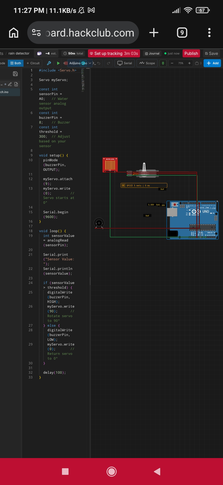

# rain detector

> Built in [Breadboard](https://breadboard.hackclub.com), a Hack Club program. This project took ~1 hours of work.

## What It Does

i have a simple project which detects rain and trigger a buzzer and at the same time a servo motor rotate 90 degree and save your cloths
'What It Does'

This project continuously monitors a water level sensor to detect raindrops. When rain is detected, the Arduino immediately triggers an active buzzer to provide an audible alert and rotates a servo motor to 90°. Once the sensor is dry again, the buzzer turns off and the servo returns to its original 0° position.

This project demonstrates basic sensor monitoring, servo motor control, and event-based automation using an Arduino.

## How to Use It

1. Assemble the circuit according to the wiring diagram.
2. Connect the Arduino to your computer using a USB cable.
3. Open the project in the Arduino IDE.
4. Select the correct **Board** and **COM Port**.
5. Upload the code to the Arduino.
6. Place the water level sensor where it can detect raindrops.
7. Power the Arduino.
8. When rain falls on the sensor:
   - The buzzer will sound.
   - The servo motor will rotate to **90°**.
9. Once the sensor dries:
   - The buzzer will stop.
   - The servo will return to **0°**.
10. If needed, adjust the sensor threshold in the code to change the detection sensitivity.

## Bill of Materials 

| Component | Quantity | Purpose |
|-----------|:--------:|---------|
| Arduino Uno (or Nano) | 1 | Main microcontroller |
| Water Level Sensor Module | 1 | Detects rain/water |
| SG90 Micro Servo Motor | 1 | Rotates 90° when rain is detected |
| Active Buzzer (5V) | 1 | Provides an audible alert |
| Jumper Wires | 1 Set | Electrical connections |
| Breadboard (Optional) | 1 | Prototyping the circuit |
| USB Cable | 1 | Programming and powering the Arduino |
| 5V Power Supply (Optional) | 1 | Recommended for powering the servo separately |

## ⚙️ How It Works

The system continuously monitors a water level sensor for raindrops. When rain is detected, the Arduino compares the sensor reading against a predefined threshold.

If the threshold is exceeded:
- The active buzzer sounds to immediately alert the user that rain has been detected.
- The SG90 servo motor rotates **90°** to simulate closing or opening a mechanical device, such as a rain cover, window, vent, or protective lid. This demonstrates how the project can automatically protect equipment from rain without requiring human intervention.

When the sensor becomes dry:
- The buzzer turns off.
- The servo returns to **0°**, returning the mechanism to its original position.

By combining a sensor, actuator, and alert system, the project demonstrates a basic automated control system that responds to environmental conditions in real time.

## How To Use It

i notice many time our dry cloths are wet dew to sudden rainfall so i make this prototype in which i use three module ardunouno,servo SG90,water level detector and a passive buzzer connect water
Water Level Sensor
------------------
VCC  -----------> 5V
GND  -----------> GND
S    -----------> A0

Servo (SG90)
------------
Red    -------> 5V
Brown  -------> GND
Orange -------> D9

Active Buzzer
-------------
+  -----------> D8
-  -----------> GND
and you are ready to use it

## Demo

- **Simulate it live:** [https://breadboard.hackclub.com/share/80](https://breadboard.hackclub.com/share/80), runs the firmware in the Breadboard simulator
- **View the design:** [https://taniwankenobi.github.io/breadboard-plays/p/80/](https://taniwankenobi.github.io/breadboard-plays/p/80/)

## Schematic

The editor snapshot is in `breadboard-project.json`.

## Bill of Materials

| Part | Quantity |
| --- | --- |
| buzzer-passive | 1 |
| servo | 1 |
| water-level-sensor | 1 |

## Firmware

Firmware files are in the `firmware/` folder.

## Build Journal

Build journal entries are kept in [`journals.md`](journals.md).

---

*Made in [Breadboard](https://breadboard.hackclub.com) — 1h of work*

